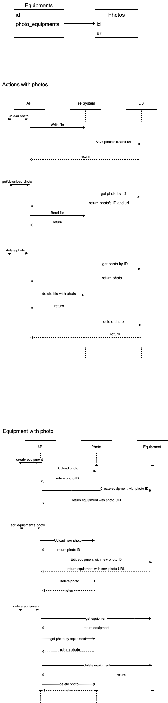

## What is this repo?
This is skeleton of CSR backend API.

Current repository provides API for following interactions:
Unauthorized APIs:
- `GET /api/docs` - swagger generated UI
- `POST /api/v1/users` - user registration (doesn't require authorization)

Authorized APIs:
- `GET /api/v1/users/me` - get current user data
- `PATCH /api/v1/users/me` - PATCH current user data

## How to run this code
Checked from unix-compatible OS.

1. Install go language binary https://golang.org/doc/install
2. Install go-swagger binary https://goswagger.io/install.html
3. Install ent binary:
    ```shell
    go get entgo.io/ent/cmd/ent
    ```
4. Install docker and docker-compose to be able run postgresql database in docker container
   https://docs.docker.com/get-docker/
   https://docs.docker.com/compose/install/
5. Init docker db:
    ```shell
    cd docker; docker-compose up -d database; cd ..;
    ```
6. Generate necessary go files (related to ent, swagger)
    ```shell
    make generate
    ```
7. Run the service: 
    ```shell
    export $(grep -v '^#' local.env | xargs) && go run -tags="sqlite_icu" cmd/swagger/main.go
    ```
   The server is here - http://127.0.0.1:8080/api
   Swagger docs are here - http://127.0.0.1:8080/api/docs
8. Service cURL request example:
   ```shell
   curl -XPOST http://127.0.0.1:8080/api/v1/users/ -vvv
   *   Trying 127.0.0.1:8080...
   * Connected to 127.0.0.1 (127.0.0.1) port 8080 (#0)
   > POST /api/v1/users/ HTTP/1.1
   > Host: 127.0.0.1:8080
   > User-Agent: curl/7.77.0
   > Accept: */*
   > 
   * Mark bundle as not supporting multiuse
   < HTTP/1.1 201 Created
   < Content-Type: application/json
   < Date: Tue, 15 Feb 2022 10:16:36 GMT
   < Content-Length: 20
   < Connection: close
   < 
   {"data":{"id":"1"}}
   ```

### For developers

To generate server files from spec:
```
swagger generate server -f ./swagger/spec.yaml -s swagger/generated/restapi -m swagger/generated/models --exclude-main
```
To generate schema:
```
go generate ./ent
```

To draw entities relationships diagram:
```
go get -u github.com/a8m/enter
enter ./ent/schema
```

### Files workflow

Files are stored in the file system. 
The name of the folder with files is set in environment variable PHOTOS_FOLDER. 
The database stores id - names of files without an extension


